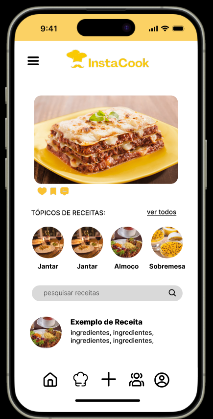
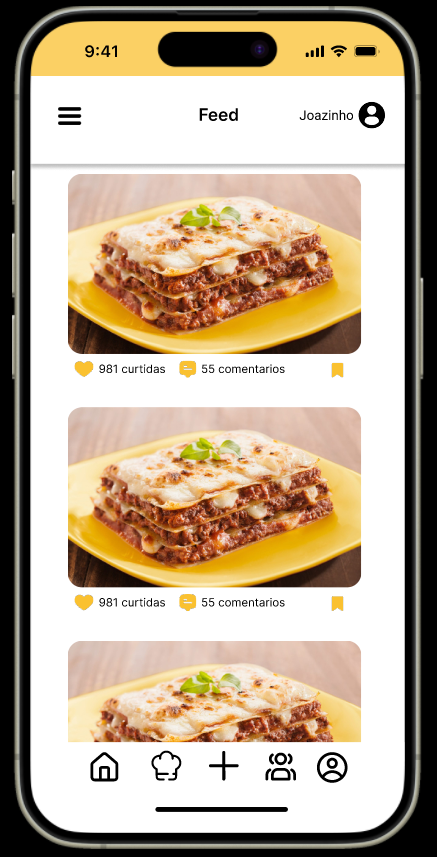
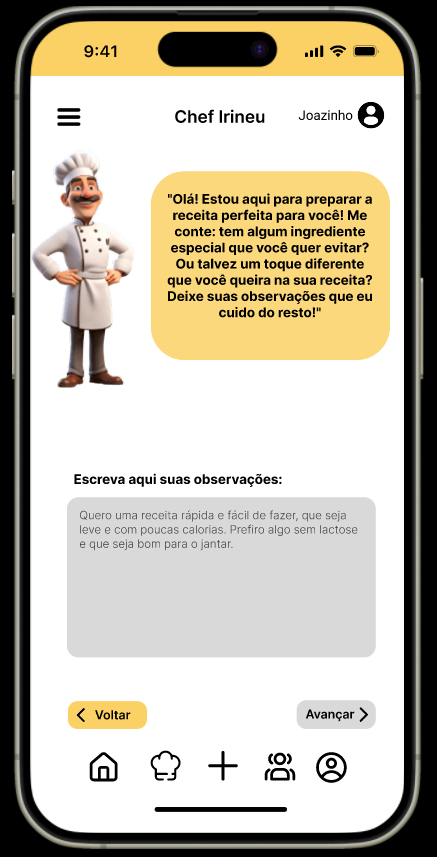

# 📱 InstaCook

**InstaCook** is a social media app **currently under development** for food lovers. The goal is to create a simple and intuitive platform where users can share their favorite recipes, explore dishes from others, and connect with fellow home cooks. Post, like, and get inspired.

---

## 🚧 Status

> 🚀 **This project is under active development.** Some features are in progress, and the app is not yet production-ready.

---

## 🎯 Main Features (in progress)

- Post recipes with images, ingredients, and preparation steps  
- View a feed with recipes from other users  
- Like and comment on posts  
- User login and profile pages  
- Search by recipe or ingredient  
- Follow other users  
- Push notifications and dark mode  

---

## 🛠 Tech Stack

- **Language:** Java  
- **Framework:** Native Android (Android SDK)  
- ## 🛠 Design

  
  
  

